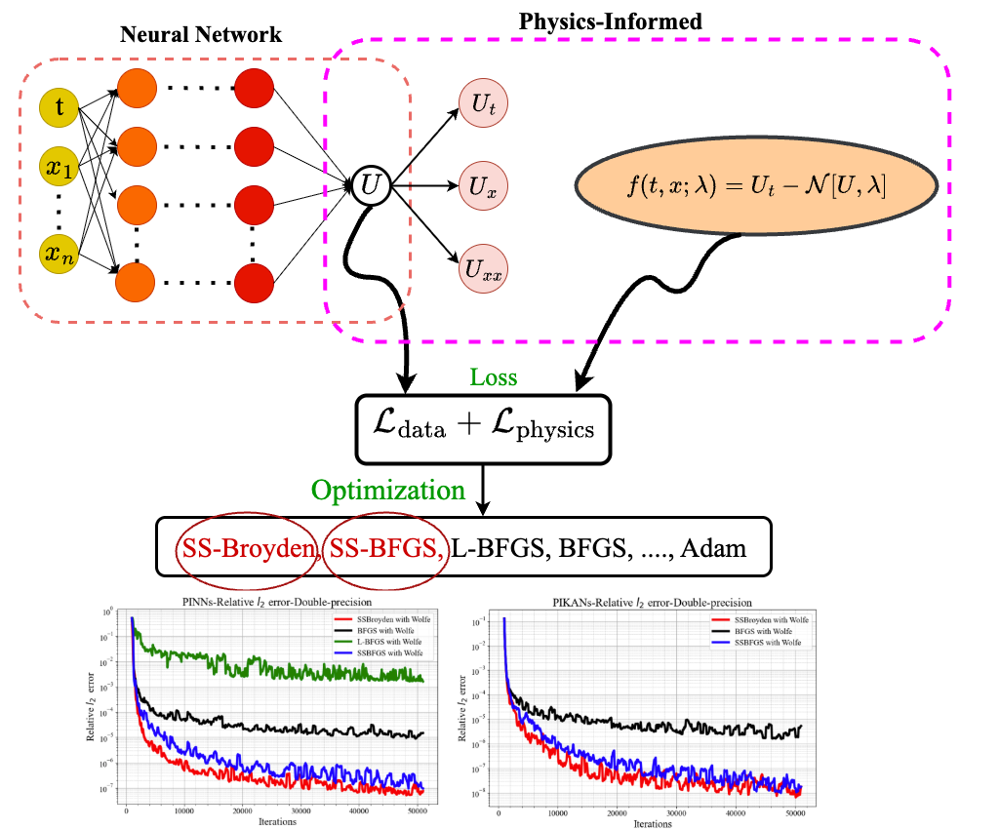

# Optimizing the Optimizer for PINNs

This repository includes the implementation of the **Self-scaled Quasi-Newton algorithms** proposed in:

**Optimizing the Optimizer for Physics-Informed Neural Networks and Kolmogorov-Arnold Networks**  
DOI: [10.1016/j.cma.2025.118308](https://doi.org/10.1016/j.cma.2025.118308)

This project requires the following Python packages and versions:

TensorFlow: 2.10.1

Keras: 2.10.0

NumPy: 1.24.1

SciPy: 1.12.0


Download _optimize.py, then overwrite SciPy’s originals located at:

.../site-packages/scipy/optimize/_optimize.py


You can control which optimizer variant is used by setting the method_bfgs parameter.

This tells the modified SciPy backend which self-scaled algorithm to apply.

For example:

method_bfgs = "SSBFGS_AB"

Other supported options include "SSBroyden", "SSDFP", "SSPSB", and "SSLBFGS".

The JAX source code is available at:

https://github.com/raj-brown/optimistix/blob/SSBFGS/optimistix




<small><b>Figure.</b> Relative ℓ₂ error for solving Burgers’ equation with BFGS, L-BFGS, SSBroyden, and SSBFGS, demonstrating the superior performance of second-order methods.</small>

<br clear="left"/>


If you use this code, please cite the paper above.

```bibtex
@article{kiyani2025optimizing,
  title={Optimizing the optimizer for physics-informed neural networks and Kolmogorov-Arnold networks},
  author={Kiyani, Elham and Shukla, Khemraj and Urb{\'a}n, Jorge F and Darbon, J{\'e}r{\^o}me and Karniadakis, George Em},
  journal={Computer Methods in Applied Mechanics and Engineering},
  volume={446},
  pages={118308},
  year={2025},
  publisher={Elsevier}
}


